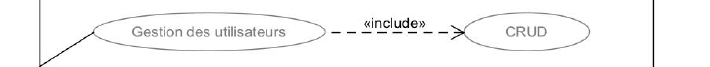
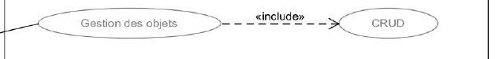

# Scenarii de tests

## Admin

### Users

- **Create** - Couverture de tests unitaires pour chaque méthodes/fonctions ✔️
- **Get All** -
  Couverture de tests unitaires pour chaque méthodes/fonctions ✔️
- **Get one by ID** -
  Couverture de tests unitaires pour chaque méthodes/fonctions ✔️
- **Update one by ID** -
  Couverture de tests unitaires pour chaque méthodes/fonctions ✔️
- **Delete one by ID** -
  Couverture de tests unitaires pour chaque méthodes/fonctions ✔️

### Items

- **Create** - Couverture de tests unitaires pour chaque méthodes/fonctions ✔️
- **Get All** -
  Couverture de tests unitaires pour chaque méthodes/fonctions ✔️
- **Get one by ID** -
  Couverture de tests unitaires pour chaque méthodes/fonctions ✔️
- **Update one by ID** -
  Couverture de tests unitaires pour chaque méthodes/fonctions ✔️
- **Delete one by ID** -
  Couverture de tests unitaires pour chaque méthodes/fonctions ✔️